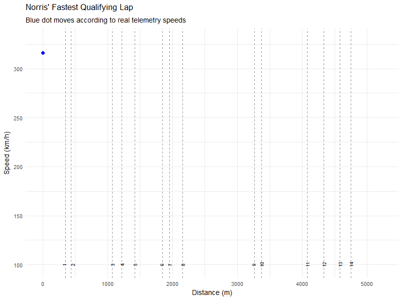

# SPE5PSA-F1 Analytics

## Overview

This project uses R and the **f1dataR** package to analyze and visualize Formula 1 telemetry data from qualifying sessions. It focuses on generating an animated visualization of Lando Norris’ fastest qualifying lap—with speed traces and corner markers (using 2024 Melbourne circuit details as a proxy)—to help illustrate how telemetry data translates into on-track performance.

## Features

-   **Data Loading:** Retrieve qualifying results and lap-by-lap telemetry using `f1dataR`.
-   **Visualization:** Create detailed plots using `ggplot2` (speed vs. distance, etc.).
-   **Animation:** Animate the lap data with `gganimate` to show the progression of Norris' lap in real time.
-   **Corner Markers:** Overlay track corner information using `ggrepel` for clear, non-overlapping labels.
